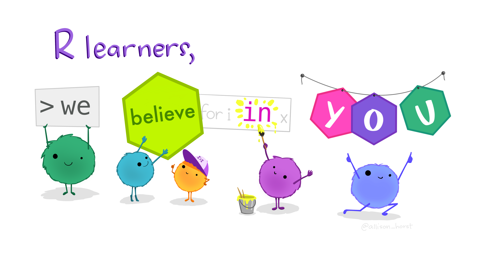

<style>
@import url('https://fonts.googleapis.com/css2?family=Roboto+Mono&family=Roboto+Slab&family=Source+Sans+Pro:wght@300;400&display=swap');
</style> 

```{r setup, include=FALSE}
library(learnr)
library(shiny)
library(tibble)
library(gradethis)
gradethis::gradethis_setup()
tutorial_options(exercise.blanks = T)
options(tutorial.exercise.timelimit = 30)

# reading in here so we have access to it later
bigfoot <- read.csv("data/bigfoot.csv")

```

## 1. Welcome to R!

In this tutorial, you will be introduced to some R basics, including:

-   How to store values (both individual values and tabular data)
-   Evaluate a dataset once it's been read into R
-   Simple functions
-   Simple plots

### Prerequisites

This tutorial has the following prerequisites:

-   Have R and R Studio installed

{width=100%}
[Artwork by @allison_horst](https://twitter.com/allison_horst)

### Structure of this tutorial

In this tutorial you will come across information presented in several different formats. Along with textual information, there will also be code blocks that can be modified and run within your browser. Some code blocks are just for showing examples while others have been setup to be evaluated as exercises. There may also be multiple choice questions. Examples of each of these formats are shown below. 

#### Example code:
Code blocks withe example code work the same way as writing code in RStudio or your preferred IDE. Comments will be preceded by `#` and will not be evaluated. Code blocks that are being used as examples will often already have code written in them. To run the pre-existing code, use the `Run Code` button in the upper right corner. Although there may be pre-existing code, you can still modify or add on to it and then run the modified version (Testing in encouraged!). If you want to reset the code block to its original state, you can press the `Start Over` button in the upper left hand corner of the code block. There may also be hints available to help you complete code snippets. If so, there will be a `Hints` button next to the `Start Over` button.   

```{r codeblock_ex, exercise=TRUE}

# This is an example of a code block
print("Hello World!")

```

```{r codeblock_ex-hint-1}

# Hint 1 :)
# Press 'Next hint` for more help. 

```

```{r codeblock_ex-hint-2}

# Yay, you made it to hint 2!

```

#### Coding exercise:
Coding exercises have been designed to be evaluated and will provide you with feedback on your code if it does not match the expected solution. Often times, these exercises will contain blanks represented like this `____` which indicate a space where you are expected to fill in the code. These code blocks will have the same buttons as example code, but will also have a `Submit Answer` button. **It is recommended that you first run your code and make sure that you are happy with the output before submitting your answer.**
  
```{r codeblockex_ex, exercise=TRUE}
  
  # Fill in the blank with the answer needed to complete the equation 
  2 + ____ == 4
  
```

<div id="codeblockex_ex-hint">
The `==` symbol indicates equivalence and not assignment. 
</div>

```{r codeblockex_ex-solution}

  # Fill in the blank with the answer needed to complete the equation 
  2 + 2 == 4

```

```{r codeblockex_ex-check}
grade_this_code()
```

#### Mutliple choice questions:
There can also be traditional multiple choice questions for you to answer about coding concepts or the output of your exercises. 

```{r example_question-a, echo=FALSE}
question("Select yes below:",
  answer("Yes", correct = TRUE),
  answer("No", message = "I respect your defiance, but please just select Yes."),
  allow_retry = TRUE
)
```


## 2. Create R Objects


### Individual Values
The first thing we are going to discuss is how to store information in variables in R. We do this by using the `<-` or `=` symbols. You can store numeric, text, and various other types of values. For now, just run the code and see what happens.

```{r assign_variables, exercise=TRUE}
x <- 5
y = 4
z = 'Hello world'

print(paste0("x = ", x)) # the paste0 function allows you to join 
print(paste0("y = ", y)) # different information together as text
print(paste0("z = ", z))

```

Once a variable is assigned you can use it in expressions or update the value. The code below illustrates these capabilities. 

```{r use_variables, exercise=TRUE}
x <- 5
y = 4

# Using the variables in an expression
x_y <- x+y
print(paste0("The sum of x and y is ", x_y))

# Updating the value of x.
print(paste0("The orignal value of x was ", x))
x <- x+y
print(paste0("After updating, the new value of x is ", x))

```

### Data types
There are many different data types in R such as character(text information), numeric(integer and decimal), and logical(true or false). Unlike some other programming languages, you do not need to explicitly state the data type when creating a variable. For more information on data types in R, you can review this [documentation](https://cran.r-project.org/doc/manuals/r-devel/R-lang.html#Basic-types).
If you want to check the data type of a pre-existing variable, you can use the `class()` function.  
```{r datatype_variables, exercise=TRUE}
x <- 5
y = "Hello"

print(paste0("The data type of x is ", class(x)))
print(paste0("The data type of y is ", class(y)))


```


### Functions
In the above code blocks, we used the `print()` and `paste0()` **functions** to format the way the output was formatted. A function is a verb; it tells R to do something. To call an R function, we call the name of the function followed directly by `()`. The items passed to the function inside the () are called **arguments**. Arguments change the way a function behaves. 

While working in R, you will probably use many different functions. One way to learn about the potential arguments for a function is with the `help()` or `?` functions which are called as follows: `help(function_name)` or `?function_name`. Doing this will open the R Documentation in your browser. If you're using RStudio, you can also find this information in the **Help** pane.

```{r help_fucntions, exercise=TRUE}
# calling the help functions
help(paste0)
?paste0

``` 


### Multiple values (1-D)
Let's create some more R objects that are collections of several values. To accomplish this, we will use the function `c()`, which stands for concatenate or combine. Usually functions are named with a full word describing what they do but because combining items together is so common, this function gets a very short name.


```{r lists_variables, exercise=TRUE}
x_list = c(1,2,3,4)
y_list = c(4,3,2,1)

print(x_list)
print(y_list)

```

Not only can you store multiple values together in this way, but you can also perform operations on them. For example, you could use the `sum()` function to add all the values together or the `mean()` function to calculate the mean.

```{r lists_variables2, exercise=TRUE}
x_list = c(1,2,3,4)

# sum function example
x_sum = sum(x_list)
# mean function example
x_mean = mean(x_list)

print(paste0('The sum of x_list is ', x_sum))
print(paste0('The mean of x_list is ', x_mean))

```

You can also perform operations on the individual values stored within a list or even add lists together. Most functions in R are **vectorized** meaning that they will work on a vector as well as a single value. This means that in R, we usually do not need to write loops like we would in other languages.
```{r lists_variables3, exercise=TRUE}
x_list = c(1,2,3,4)

x_list_plus5 = x_list + 5
print(paste0('x_list_plus5: ', paste(x_list_plus5, collapse = " ")))


y_list = c(4,3,2,1)
x_y_list = x_list + y_list
print(paste0('x_y_list: ', paste(x_y_list, collapse = " ")))

```
Looking at the above output, what have we learned about performing operations on lists? In the first example, we added a single value (5) to our list and in the output we can see the addition was applied to each value in our list. In the second example, we applied the addition operation on two lists of the same length. In it's output, we can see that the first items in the lists were added together (1+4), then the second items in the lists (2+3), etc. till the end of the lists. This is because these operations are vectorized. 

### Exercise 1

Use the code chunks below to complete some practice exercises

1. Create a list that contains the following values: 100, 50, 95, 80 and store it in the `ex1_list` variable
2. Calculate the sum, mean, median, and the standard deviation

    ```{r ex1_variables, exercise = TRUE}
    # Create your list here
    ex1_list <- ____
    # Calculate the sum
    ____(ex1_list)
    # Calculate the mean
    ____(ex1_list)
    # Calculate the median
    ____(ex1_list)
    # Calculate the standard deviation
    ____(ex1_list)

    ```
<div id="ex1_variables-hint">
If you're not sure what function you need to use, you can try googling the task + R. For example, if you google 'standard deviation R', the first link is: https://www.digitalocean.com/community/tutorials/find-standard-deviation-in-r and suggests using the `sd()` function. There are many great online resources for R.   
</div>

    ```{r ex1_variables-solution}
    # Create your list here
    ex1_list <- c(100,50,95,80)
    # Calculate the sum
    sum(ex1_list)
    # Calculate the mean
    mean(ex1_list)
    # Calculate the median
    median(ex1_list)
    # Calculate the standard deviation
    sd(ex1_list)
    ```

```{r ex1_variables-check}
grade_this_code()
```

### Exercise 2
In this exercise, we will create two lists of different lengths and then subtract one from the other.

1. Create a list called list_a with the following values: 20, 15, 23, 32, 47, 18
2. Create another list called list_b with the following values: 5, 7
3. Subtract list_b from list a and view the results
    ```{r ex2_variables, exercise = TRUE, exercise.lines =6}
    # Create list_a here
    list_a <- ____
    # Create list_b here
    list_b <- ____
    # Subtract list_b from list_a
    

    ```

    ```{r ex2_variables-solution}
    # Create list_a here
    list_a <- c(20, 15, 23, 32, 47, 18)
    # Create list_b here
    list_b <- c(5,7)
    # Subtract list_b from list_a
    list_a-list_b
    ```

    ```{r ex2_variables-check}
grade_this_code()
```

### Mutliple choice questions
```{r ex2_question-a, echo=FALSE}
question("Which best describes what occurred above when lists of different sizes were subtracted?",
  answer("It fails. Lists must be the same size to perform subtracts"),
  answer("Since the smaller list had two values, substraction was only peformed for the first two values"),
  answer("Because substraction is vectorized, the smaller list is repeated to match the length of the longer list", correct = TRUE)
)
```

```{r ex2_question-b, echo=FALSE}
question("In the paste and paste0 functions, would does the collapse argument represent?",
  answer("A character string to separate the terms", message = "Close! Try double checking the help documentation. "),
  answer("An optional character string to separate the results", correct = TRUE),
  answer("An optional argument which indicated if the output should be compressed", message = "If you're note sure, where can you find information about the arguments of a function?"),
  allow_retry = TRUE
)
```

## 3. Tabular Data

### Creating dataframes
R has a few different types of objects. We already saw some vectors (one dimensional collection of items) in the previous section.

R's dataframes store two dimensional, tabular, heterogeneous data. Two-dimensional or tabular refers to a table of rows and columns that form the 2 dimensions. Heterogeneous refers to the fact that each column can contain a different type of data (i.e., one column Age is numeric while Gender is a character).

The first thing we're going to do is build on the previous section and build a dataframe from lists. To do this we will create two lists that represent different columns and then use the `data.frame()` function to combine them into a dataframe.  

```{r make_df, exercise=TRUE, paged.print=FALSE}

# column of names
name_col <- c("Sarah", "Joe", "Hannah")
# column of ages
age_col <- c(25, 26, 22)

# create dataframe
print("Using list names as column names:")
df <- data.frame(name_col, age_col)
df
print("")

# we can also provide column names when creating the dataframe
print("Specifying column names:")
df <- data.frame(name = name_col, 
                 age = age_col)
df


```

While you can use R's basic dataframes, you can also use **tibbles** which are a more modern version of the dataframe. Tibbles never alter a columns input type or adjust variable names and they have a cleaner print function. You can read more about tibbles here: https://r4ds.had.co.nz/tibbles.html.

We will repeat the above code, but use tibbles instead of base dataframes. Since we are using a small dataset as an example, the differences between dataframes and tibbles aren't the most obvious, but in general tibbles are recommended. 
```{r make_tibble, exercise=TRUE}

# column of names
name_col <- c("Sarah", "Joe", "Hannah")
# column of ages
age_col <- c(25, 26, 22)

# Using the tibble function instead of data.frame()
df <- tibble(name = name_col, 
                 age = age_col)
df


```


In the above examples, we created tables from scratch. It is more likely that you will already have data stored in a file like a csv which you then read into R to analyze. Below we will use the `read.csv()` function which comes with your normal Base R installation to read in a file. Later on, we will use a different version of this function. We will also be using the `head()` function which allows us to look at just the first 6 entries. 

```{r read_bigfoot, exercise=TRUE}
bigfoot <- read.csv("data/bigfoot.csv")
# By default head returns the first 6 entries. You could look at the head function's  
#    arguments to find out how to change that default behavior
head(bigfoot)

```

<div id="read_bigfoot-hint">
Once you run the code, you can use the arrows in the upper left corner of table to display the rest of the columns. 
</div>


### Overview or your data

Once you have read in a dataset, you will want to get familiar with it. You may want to know the number of observations or rows that you have as well the number of attributes or columns that you have. To accomplish this you can use the `dim()` function to return the dimensions of the dataframe or you could use the `nrow()` and `ncol()` functions to specifically request the number of rows or columns.   

```{r dim_bigfoot, exercise=TRUE}
# dim returns the rows then columns
dim(bigfoot)

# individual components
nrow(bigfoot)
ncol(bigfoot)

```
You may also want to review the names of your columns and their associated data type. To do this, you can use the `names()` and the `str()` function. The `summary()` function is another option that returns an overview of the dataset. Another thing to pay close attention to is the presence of missing or `NA` values because they could have implications for how you will process your data. 

If you just want to view your column names, you can use the `names()` function. In the bigfoot dataset, we have several attributes including: title, state, date, season, etc. One thing the `names()` function does not provide is the **data type** of each attribute. 
```{r names_bigfoot, exercise=TRUE}
# list the column names 
names(bigfoot)

```

If you wast to know the data type of all of your attributes, the `summary()` and `str()` functions provide that information. Both of these functions also provide additional information as well. The `summary()` function provides summary statistics (including the number of `NA` values) for numeric attributes and the `str()` function provides a snippet of the data in each column.  
```{r summar_bigfoot, exercise=TRUE}
# provides an overview of the dataset
print("Summary output:")
summary(bigfoot)
print("")

print("Str output:")
str(bigfoot)


```


### Accessing specific attributes
Once you're comfortable with your dataset, you may want to access specific columns or values in order to manipulate your data. You might have noticed a `$` in front of the variable names in the `str()` output. That symbol is how we access individual variables, or columns, from a dataframe.

The syntax we want is **dataframe$columnname**. Not only can we pull out a specific column, but we can also pass it to other functions. Let's look at the `title` and `uv_index` columns from the bigfoot dataset. We'll use the `class()` function to confirm that `uv_index` is **numeric** and then we'll calculate the mean. Checking the data type of your attributes is important because data may not always be read into R as you expected. For example, a numeric value may be read in as character type if that column contains values like "N/A".    
```{r access_bigfoot, exercise=TRUE}
# viewing specific columns
head(bigfoot$title)
head(bigfoot$uv_index)

# check the data type of uv_index
print(paste0("The data type of uv_index is ", class(bigfoot$uv_index)))

# use the mean function to find the average of the uv_index
# because the uv_index column has NA values, we'll set na.rm = T to ignore them in our calculation
print(paste0("The mean uv_index value from the bigfoot dataset is ", 
             mean(bigfoot$uv_index, na.rm = T)))

```


In the above code, we called the `mean()` function on the `uv_index` column. Not only did we provide the data we wanted to perform the calculation on, but was also used the argument `na.rm` which we set to `TRUE`. Normally this argument has a default value of `FALSE`. If you want to learn more about the `na.rm` argument, you could use the `help()` or `?` functions as discussed earlier in the tutorial.  

### Exercise 1
1. What's the standard deviation for humidity (`humidity`)?
2. What's the maximum temperature for a bigfoot sighting?
3. How many observations are from Virginia (look at hint button in needed)?

```{r ex1_table, exercise = TRUE, exercise.lines =6}
    # Calculate the standard deviation of humidity
    
    # Calculate the max temperature
    
    # Calculate how many observations are from Virginia
    
   

```

<div id="ex1_table-hint">
1) If you use a function and it returns NA, consider setting `na.rm = T`. This will allow you to use the function on the observations that actually have a value; however, you should still consider how missing values affect your analysis. 
</div>

<div id="ex1_table-hint">
2) If you're not sure what function you need to use, you can try googling the task + R. For example, if you google 'get count of each value in a column R', the first link is: https://www.statology.org/r-count-number-of-occurrences-in-column/ and suggests using the `table()` function. There are many great online resources for R.   
</div>


```{r ex1_table-solution}
    # Calculate the standard deviation of humidity
    sd(bigfoot$humidity, na.rm = T)
    # Calculate the max temperature
    max(bigfoot$temperature, na.rm = T)
    # Calculate how many observations are from Virginia
    table(bigfoot$state)
    
```

```{r ex1_table-check}
  grade_this_code()
```

## 4. Basic Plots
Next we'll create a plot to show something about our `bigfoot` dataset. Today, we'll start with simple plots that use base R functions. In the future, as we move through these tutorials, we'll make more complex plots using `ggplot`.

Often we want to know how our data is distibuted, so we'll start by creating a histogram of temperature using the `hist()` function.
```{r hist_plot, exercise=TRUE}
# histogram of temperature
hist(bigfoot$temperature)

```
We could also use boxplots to examine the distribution of our data. We'll create side by side boxplots examining the number of observations by season. We'll accomplish this with the `boxplot()` function. To split the data by season we'll use the `~` symbol to specify observations by season. 

We'll also adjust the title and labels to make the plot seem more professional. There are many ways to modify plots. You can refer to the documentation of the different types of plots for more details.

```{r boxplot_plot, exercise=TRUE}
# boxplot of observatons by season
boxplot(data = bigfoot, number~season,
        main = "Observations by Season",
        xlab = "Season",
        ylab = "Number of Observations")

```
Just like the `str()` and `summary()` functions, visualizing your data is another way to become familiar with it. The above plot shows that sometimes the Season attribute is missing and instead of being left blank or given an `NA` value it was input as **Unknown**. Understanding the expected values for your data and how missing data was input is crucial for both data visualization and analysis. 


## 5. Additional Functionality
### Installing and Loading Packages.

The next two sessions of this workshop series will show how to prepare data in a dataset and how to graph/visualize your data. 

In order to use additional functionality in R, we bring in packages. The `install.packages()` function installs the package to your local machine, while the `library()` command loads the functions from that package into the R environment so that we can use them. You need to run the `library()` function every time you open a new script/markdown file, but you do not need to run the `install.packages()` function every time.

In this case, the code opened a library containing R functions we want to use. You can think of libraries like apps on your phone. We have now opened the app so we can use it. You can use the `search()` function to see all the libraries you currently have loaded. 

```{r install_libraries, exercise=TRUE}
#install.packages("tidyverse")
library(tidyverse)
print(search())
```

The `tidyverse` package is actually a megapackage, containing 8 packages. All of these packages share a similar syntax in an attempt to simplify coding and readability for R users. Aside from the core tidyverse packages, there are around 10 other packages. The tidyverse contains many useful fucntions for cleaning and analyzing data with syntax that is human readable. In future tutorials, we will continue to use the `tidyverse`. 

### RStudio
RStudio is an IDE commonly used to write and run R scripts. Although we did not use it for this tutorial, it is what you will most likely be using when you begin to write your own scripts. It is composed of several different panes, including:

- On the top left is the **script** window. This is where we write all of our code and notes.
- On the lower left there's the **console** window. This is where R tells us what it thinks we told it and then the answer. This part is what R would look like (without RStudio)
- The top right has the **environment** and history tabs. The environment is a list of all objects that R knows and the history tab shows all the code that has been run.
- On the bottom right there's a window with lots of tabs. Files provides the file structure in the working directory. **Plots** is where your visualizations will appear. Packages shows all of the installed packages and one that are checked are opened. **Help** is where we will learn about functions when we need assistance and the Viewer is for viewing other kinds of output, like web content.

{width=100%}

## 6. Further Resources
### Learning more R

- [R4DS](https://r4ds.had.co.nz/): R 4 Data Science - a free e-book with excellent, engaging exercises

- [RStudio Primers](https://rstudio.cloud/learn/primers) Engaging online lessons to teach you introductory R skills

- [RStudio's cheat sheets](https://www.rstudio.com/resources/cheatsheets/)

- [Jenny Bryan's Stat 545 "Data wrangling, exploration, and analysis with R" course material](https://stat545.com/): An excellent resource for learning R, dplyr, and ggplot2

## 7. Troubleshooting coding

- Read package vignettes. For example, see the [introduction to dplyr](https://cran.r-project.org/web/packages/dplyr/vignettes/dplyr.html) vignette.

- [Google it!](http://lmgtfy.com/?q=R+Error+in+library+there+is+no+package+called): Try Googling generalized versions of any error messages you get. That is, remove text that is specific to your problem (names of variables, paths, datasets, etc.). You'd be surprised how many other people have probably had the same problem and solved it.

- [Stack Overflow](http://stackoverflow.com/questions/tagged/r): There are over 100,000 questions tagged with "R" on SO. [Here are the most popular ones, ranked by vote](https://stackoverflow.com/questions/tagged/r?sort=votes). Always search before asking, and make a [reproducible example](http://stackoverflow.com/questions/5963269/how-to-make-a-great-r-reproducible-example/5963610#5963610) if you want to get useful advice. This is a minimal example that allows others who are trying to help you to see the error themselves.

